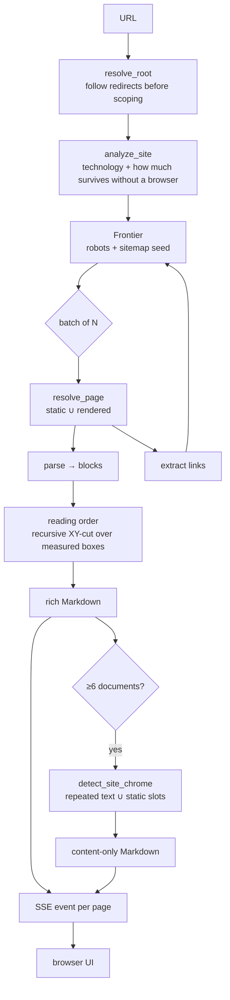

# webgraph

**Universal web content extraction with provenance and recovered reading order.**

webgraph takes a website — not a page, a *website* — and returns every public page as clean,
ordered Markdown, together with an account of where each piece of information came from and
how it was obtained.

```bash
make install     # uv sync + playwright chromium + pnpm install
make api         # FastAPI on :8000
make web         # Next.js on :3000
```

Then open <http://localhost:3000>, type a domain, and watch the crawl stream.

---

## Contents

- [What this is, and what it is not](#what-this-is-and-what-it-is-not)
- [The three problems](#the-three-problems)
- [Architecture at a glance](#architecture-at-a-glance)
- [Repository layout](#repository-layout)
- [Stage 1 — Technology detection](#stage-1--technology-detection)
- [Stage 2 — Route discovery](#stage-2--route-discovery)
- [Stage 3 — Fetching: the union strategy](#stage-3--fetching-the-union-strategy)
- [Stage 4 — Reading order](#stage-4--reading-order)
- [Stage 5 — Rich Markdown](#stage-5--rich-markdown)
- [Stage 6 — Cross-page analysis](#stage-6--cross-page-analysis)
- [Schema mapping and the refusal to guess](#schema-mapping-and-the-refusal-to-guess)
- [Serving it: streaming, cancellation, concurrency](#serving-it-streaming-cancellation-concurrency)
- [The front end](#the-front-end)
- [How it is measured](#how-it-is-measured)
- [The graph layer](#the-graph-layer)
- [Where it stands against other tools](#where-it-stands-against-other-tools)
- [Known limitations](#known-limitations)
- [Design principles](#design-principles)
- [Contributing](#contributing)

---

## What this is, and what it is not

**It is** an extraction engine plus a service and a UI around it. Give it a domain and it
will tell you what the site is built with, enumerate every page it can reach, and hand back
each page's content as Markdown with the site's navigation and footer separated out.

**It is not** a general-purpose scraping framework, a headless-browser rental, or an
LLM wrapper. There is no model in the extraction path. Everything below is deterministic and
reproducible, which is what makes the benchmarks meaningful.

The design is shaped by one commitment that shows up everywhere: **the engine reports how it
knows something, and declines when it does not know.** A reading order that was measured is
labelled differently from one that was assumed. A field with no supporting evidence yields
no value rather than a plausible one.

---

## The three problems

Most extraction tools solve the third problem and quietly assume the first two away.

### 1. You do not know which pages exist

`sitemap.xml` is advertising, not inventory. On one site measured here it listed **4 URLs**
while the site served **75 live pages**. On another the sitemap advertised URLs over `http://`
while the server only answered on `https://`, so a naive reader would have retrieved zero
pages. Sitemaps also list dead URLs: pages that 404 today are still advertised.

Following links from the homepage is not enough either. Once the oracle looks two levels
deep, homepage-only link following finds **26.5%** of what is actually reachable.

### 2. You do not know how much of the page you are getting

Some pages are complete in their HTML. Some are an empty `<div id="root">`. Many are in
between: server-rendered content *plus* client-inserted content, or — surprisingly often —
content present in the HTML that a client-side framework then **removes** on hydration.

The obvious answer is to predict which pages need a browser and render only those. Measured
here on pages that demonstrably lost content without rendering, prediction scored **0 out of 7**.

### 3. You do not know what order the content is in

Source order is not reading order. CSS reorders content freely: `order` on flex children,
`flex-direction: row-reverse`, explicit `grid-row` / `grid-column`, floats, absolute
positioning. A depth-first DOM walk therefore produces *silently* jumbled text on exactly
the pages where sequence matters most — documentation, news, papers, anything multi-column.

Sorting blocks by their `y` coordinate does not fix it: on a two-column page it interleaves
the columns line by line, which is worse than source order.

---

## Architecture at a glance



Two things about this shape are deliberate and both were arrived at by getting them wrong first.

**Discovery and extraction are interleaved, not sequential.** Enumerating an entire site
before extracting anything means staring at nothing for minutes on a large site, *and* it
caps the crawl at whatever the sitemap happens to list. Here each extracted page's links
extend the frontier, so the crawl reaches everything reachable and the first result arrives
in seconds.

**Cross-page analysis feeds back into per-page output.** Site chrome cannot be identified
from one page. It is computed once the corpus is large enough and then applied to every
page, including the ones already emitted — which is why each page event carries both the
full Markdown and the content-only Markdown.

---

## Repository layout

```
packages/engine/          # the extraction engine — no HTTP, no UI, importable
  src/webgraph/
    analyze.py            # site-level profiling: technology, render behaviour
    resolve.py            # fetch strategies: static / rendered / union
    pipeline.py           # HTML -> Document (blocks, order, provenance)
    site.py               # the interleaved crawl+extract generator
    boilerplate.py        # cross-page site-chrome detection
    render_markdown.py    # Document -> Markdown
    types.py              # Block, Document, Fact, Rect, Verification
    crawl/                # frontier, normalisation, robots, sitemaps, discovery
    dom/                  # block parsing, rich inline markup, reading order
    fetch/                # static fetch, browser rendering, browser reuse
    extract/              # JSON Schema mapping with provenance
    profile/              # technology fingerprints, payload fingerprints
    structured/           # JSON-LD, microdata, RDFa, framework payloads
    eval/                 # benchmark harness and metrics
apps/api/                 # FastAPI service (streaming SSE)
apps/web/                 # Next.js 16 + Tailwind v4 front end
benchmark/                # extraction corpus + route-discovery oracle
docs/                     # research notes and PRDs
MEMORY.md                 # the engineering journal — read before changing extraction
```

The engine has no dependency on the API or the web app, and ships a `py.typed` marker. It
can be used as a library or through its CLI (`webgraph extract`, `webgraph bench`).

---

## Stage 1 — Technology detection

**What it does.** Fingerprints the site across three signal sources and reports each
technology with a category, an optional version, a confidence, and the evidence that
produced it.

**Why three sources.** Each carries things the others cannot:

| source | carries | example |
|---|---|---|
| response headers | server-side stack | `Apache/2.4.37`, `PHP/7.4.33`, `OpenSSL/1.1.1k` |
| markup | client frameworks, analytics, fonts, CDNs | `<script src=".../gtm.js">` |
| runtime JavaScript | library versions and *bundled* frameworks | `jQuery.fn.jquery`, `__reactContainer$` |

An early version read only HTML and reported "none detected" for a site running Apache, PHP
and OpenSSL — all three visible in the response headers it never looked at.

**The hardest part is not matching, it is not matching.** A bare keyword fires on a page
that merely *writes about* a technology. `docs.astro.build` was once reported as running
Strapi and Alpine.js purely because its sidebar links to `/guides/cms/strapi/`. Every rule
is therefore anchored to something a page can only emit by using the technology: a `src` or
`href` attribute, a generator meta tag, a namespaced class, a data attribute, a JavaScript
global. A consent-manager vendor table once produced 35 technologies including four
competing chat widgets; anchoring host rules to `src`/`href` cut one site from 35 detections
to 15, all real.

**Bundled frameworks need a different kind of evidence.** A Vite build of React exposes no
`window.React` and mentions React nowhere in its markup. It does leave private properties on
the DOM nodes it owns (`__reactContainer$…`, `__reactFiber$…`), so the browser-side
collector scans for those. Same idea for Preact, Vue, Svelte and React Router.

<details>
<summary><strong>Alternatives considered</strong></summary>

| approach | pros | cons | verdict |
|---|---|---|---|
| Vendor a Wappalyzer ruleset | thousands of rules, maintained | every live fork (`enthec`, `HTTPArchive`, `dochne`) is **GPL-3.0**; vendoring would force this project to GPL | rejected on licence, verified via the GitHub API |
| Call a hosted detection API | no rules to maintain | network dependency, per-request cost, no offline use, opaque evidence | rejected |
| Hand-written rules | permissive, evidence is auditable, tunable for false positives | coverage is ours to build; currently 144 rules | **chosen** |

</details>

**Measured.** On `persyn.ai`, detection went from 4 technologies to 15, matching 13 of the
17 Wappalyzer reports. The four still missed (Radix, shadcn/ui, Tinybird, Cloudflare Bot
Management) appear only after a user interaction or a later network request, not in the
homepage's rendered DOM.

---

## Stage 2 — Route discovery

**What it does.** Builds a frontier of URLs from `robots.txt`, every sitemap it can find,
and the links on every page it extracts — then keeps going until the frontier is empty.

**Unlimited by default.** `max_pages = 0`. If a site has 19,999 pages, the crawl visits
19,999 pages. A default cap is a silent correctness bug for the use case this exists for.

### Normalisation is the whole game

`example.com/a`, `example.com/a/`, `example.com/a#top` and `example.com/a?utm_source=x` are
one page. A crawler that treats them as four spends its budget four times over and produces
four copies of every entity. The frontier deduplicates on a **canonical key** — scheme and
`www.` folded, tracking parameters stripped, fragment dropped, trailing slash normalised —
while queueing the URL the site actually linked to, so the request goes to the URL the
server expects.

### Four bugs this area produced, all found by measurement

1. **`www` vs bare domain.** Scoping compared hostnames literally, so a crawl seeded at
   `persyn.ai` rejected every `www.persyn.ai` link and stopped after one page instead of 54.
2. **Cross-host redirect.** `docs.pydantic.dev` redirects to `pydantic.dev`; scoping on the
   *requested* root rejected everything. Resolving the root first took that crawl from 2
   pages to 2,073.
3. **Sitemap scheme mismatch.** A sitemap advertising `http://` on an https-only host would
   have yielded zero live pages. Schemes are now reconciled against the root.
4. **404 pages extracted as content.** A soft-404 became "# Not Found" in the output. HTTP
   status is now a gate: 404 and 410 raise rather than extract.

<details>
<summary><strong>Alternatives considered</strong></summary>

| approach | pros | cons | verdict |
|---|---|---|---|
| Sitemap only | cheap, fast, polite | incomplete and stale — 4 advertised vs 75 live on one site | insufficient alone |
| Homepage links only | no sitemap dependency | **26.5%** recall against a two-level oracle | insufficient alone |
| Sitemap ∪ link crawl, verified | highest recall; dead URLs filtered | more requests; needs politeness controls | **chosen** |
| Depth-first crawl | simple | with any budget it disappears into one blog archive and never reaches `/pricing` | rejected — frontier is breadth-first |

</details>

**Measured.** Against a real-browser oracle across 93 sites: **97.7% mean route recall**,
perfect on 85 of them. Static-only discovery scores 91.4% against a shallow oracle and
**26.5%** once the oracle explores two levels — the shallow benchmark had been flattering
static discovery enormously.

> Four of that benchmark's own bugs were found by running it: a self-link counted as a miss,
> seeding from the pre-redirect URL, raw-string comparison instead of canonical keys, and
> oracle and engine selecting sub-pages in different orders. **Distrust the harness at least
> as much as the thing it measures.**

---

## Stage 3 — Fetching: the union strategy

Three strategies exist; one is the default.

| strategy | what it does | when to use |
|---|---|---|
| `STATIC_ONLY` | one HTTP request | fast bulk crawls of known-static sites |
| `RENDERED_ONLY` | Chromium, measured geometry | you only care about the rendered result |
| `UNION` | both, merged | **default** — the only one that is not lossy |

### Why not just render everything?

Because rendering *loses* content. On several sites measured here, the rendered DOM has
**less** text than the static HTML: frameworks replace server-rendered markup on hydration,
lazy-mounted sections never mount without scrolling, and consent scripts remove content.

### Why not predict which pages need rendering?

That was the original design. A `requires_render` heuristic looked at page length, script
density and framework markers. On the seven sites that measurably lost content on the static
path, it returned `False` for **all seven**. Accuracy: **0/7**.

The conclusion was not "improve the heuristic". It was that the question is not answerable
from the static response, and the engine should stop asking it. `UNION` fetches both and
merges by content hash: **union beat static-alone on 8 of 10 sites and rendered-alone on 4 of 10.**

<details>
<summary><strong>Cost, and why it is accepted</strong></summary>

Union roughly doubles per-page cost and requires a browser. The alternative is silent,
unmeasurable data loss on a fraction of pages you cannot identify in advance, which
contradicts the project's stated purpose. Callers who want speed over completeness can
select `STATIC_ONLY` explicitly — an informed choice rather than a hidden default.

</details>

### Rendering details that were arrived at painfully

- **`wait_until="load"`, never `"networkidle"`.** `networkidle` waits for 500 ms of network
  silence, which never arrives on sites with analytics beacons, polling, websockets or video
  preloading. Measured across 24 real sites it **timed out on 5 (21%)** — Shopify,
  Squarespace, Stripe, python.org and Figma — losing those pages entirely. `load` plus an
  explicit 900 ms settle fires slightly earlier but actually fires.
- **1440 × 900 viewport.** Width changes the correct answer: a narrow viewport collapses a
  multi-column layout into one column.
- **Images, media and fonts blocked.** Metrics shift slightly without web fonts, but not
  enough to change column structure — and it is a large bandwidth saving.
- **Geometry is bound by marker attribute.** Every element is stamped with `data-wg-id`
  before measurement, and the HTML is serialised *after* stamping, so measurements and
  parsed nodes cannot drift apart.

### Browser reuse

Relaunching Chromium per page was a fixed cost on every render. Playwright's **synchronous**
API binds its driver to the thread that created it, so a shared pool would require the async
API and an event loop the engine does not otherwise have. The browser is therefore
**thread-local**: a crawl worker pays the launch cost once and amortises it over every page
it handles, while each page still gets a fresh `BrowserContext` for isolation.

Measured on 12 renders:

| workers | launch per page | reused browser |
|---|---|---|
| 1 | 8.5 pages/min | **11.6 pages/min** |
| 6 | 21.9 pages/min | **39.1 pages/min** |

`MAX_BROWSERS` caps live browsers process-wide (~150 MB each). A thread that cannot get a
slot launches its own short-lived browser, so correctness never depends on the pool.

---

## Stage 4 — Reading order

**What it does.** Recovers the order a human would read the page in, from geometry rather
than from the DOM.

**How.** Recursive XY-cut over measured bounding boxes: find the widest whitespace gutter,
split there, recurse. The output is a permutation of blocks, plus a label saying how it was
obtained.

Verified against a real browser:

| layout | source order | recovered |
|---|---|---|
| `order:` on flex children | GAMMA, ALPHA, BETA | **ALPHA, BETA, GAMMA** |
| `flex-direction: row-reverse` | HEADER, RIGHT×3, LEFT×3 | **HEADER, LEFT×3, RIGHT×3** |
| explicit grid placement | B1, A1, B2, A2 | **A1, B1, A2, B2** |
| `column-count: 2` | ONE…SIX | **ONE…SIX** (correctly unchanged) |

**Two real bugs, both caught by those fixtures:**

1. Cutting horizontally first read grid *columns* across, producing row-major garbage on a
   two-column layout. Fixed by preferring whichever axis has the wider gutter.
2. Cutting at *every* gap sliced a column into its constituent rows. Fixed by cutting only
   at the widest gap and anything within 5% of it.

**When geometry is unavailable** — a static-only fetch, a failed render — the engine falls
back to source order and **says so**: `reading_order_measured: false`. It never presents an
assumption as a measurement.

<details>
<summary><strong>Alternatives considered</strong></summary>

| approach | pros | cons | verdict |
|---|---|---|---|
| DOM order | free, no browser | wrong on exactly the pages that matter | fallback only, and labelled |
| Sort by `y`, then `x` | trivial | interleaves columns line by line — worse than DOM order | rejected |
| Layout model (LayoutLM, Donut) | handles scanned documents | heavy weights, GPU, non-deterministic, unnecessary when real geometry is available | rejected — the browser already knows the answer |
| Recursive XY-cut | deterministic, explainable, cheap once rendered | needs geometry; degenerates on heavily overlapping absolute layouts | **chosen** |

</details>

---

## Stage 5 — Rich Markdown

Plain-text extraction destroys most of a page's meaning. A flattened table loses which
column a value belonged to; a stripped link loses where it pointed.

Preserved: heading levels, ordered and unordered lists with nesting, tables as Markdown
tables (ragged rows padded rather than dropped, pipes escaped), fenced code blocks with the
language and with whitespace intact, blockquotes, figure captions, images with `alt` and
absolute URLs, and inline links, emphasis and code.

Images get particular care: lazy-loading attributes (`data-src`), `srcset` fallbacks,
tracking-pixel suppression by dimension, and `data:` URI rejection.

**One structural decision worth explaining.** `Block.text` stays plain; the Markdown form
lives in a separate `Block.rich_text`. Deduplication, the content hash and reading order all
key on the plain form — folding Markdown syntax into it would change every hash and make two
renderings of the same content look different.

> This was also a measurement lesson. The first engine-versus-trafilatura comparison reported
> danluu.com as "51.8% of content missing". Both numbers were artefacts: trafilatura had been
> called with `include_links=True`, inflating its character count with `[text](url)`, while
> the engine emitted no links at all. Plain against plain, the two were **8,945 vs 9,138
> characters — 98% agreement.** Compare like with like before concluding anything.

---

## Stage 6 — Cross-page analysis

This is the part a single-page extractor structurally cannot do, and it is the clearest
argument for crawling a whole site.

### The idea

A block of text that appears on nearly every page is navigation, footer, cookie banner or
legal strip — not content. A crawler gets that for free as a by-product of having crawled.

It matters more than it looks. Feed 100 pages to an index or a model and the same navigation
arrives 100 times; on short pages it outweighs the actual content.

### Two detectors, unioned

- **Repeated text** — a block on ≥90% of pages. Catches a footer line that moves position
  between templates.
- **Static template slots** — an exact XPath present on ≥60% of pages whose content
  **never varies**. Catches chrome that repeated-text misses, and — crucially — will not
  drop a page's unique content merely because the same words appear elsewhere on the site.

**The threshold is not worth tuning.** Thresholds of 50%, 70% and 90% produced *identical*
block sets on both test sites. Chrome appears on essentially every page or on none; there is
no meaningful middle. The default is the conservative end.

**Slot identity is the exact XPath, never generalised.** An earlier version stripped
positional indices to collapse equivalent slots across pages. That over-collapsed: many
distinct blocks landed in one slot, which then held many texts and never qualified as
static. Measured effect: **+0.006 F — nothing.** With exact paths the same idea reached
F=0.950 on `docs.pytest.org`. Do not "improve" this by generalising it.

### Two guards against destroying real content

1. **A page's own leading heading is never removed.** On a category page titled "Travel",
   the sidebar link "Travel" makes the title look repeated. Dropping it would delete the one
   line identifying the page.
2. **Nothing is removed if more than half the page would go.** Crawling `docs.pytest.org`
   reached its version archive (`/en/8.2.x/`, `/en/8.1.x/`, …) — near-identical pages whose
   *shared real content* looks exactly like chrome. Detection removed 60.3% of every page.
   With the cap, near-duplicate corpora are left alone (12 pages stripped → 3) while diverse
   corpora are unaffected (8.6% removed).

The cap fails **open** on purpose: a wrong removal is silent data loss, a missed removal is
noise the caller can still see and handle.

**Measured**, against a majority vote of trafilatura / readability / jusText across four
diverse sites:

```
raw              F = 0.725
chrome-stripped  F = 0.760     recall unchanged on all four (0.903 / 0.986 / 0.991 / 0.995)
trafilatura      F = 0.903
```

Precision gains ranged from +0.001 to +0.093. `danluu.com` has almost no chrome (2 blocks)
and correctly changed by roughly zero — the detector does not invent chrome where there is
none.

---

## Schema mapping and the refusal to guess

Give the engine a JSON Schema and it maps the page onto it. Every value returns as a `Fact`
carrying the extractor that produced it, the modality (JSON-LD, microdata, OpenGraph,
heuristic), the source, the source XPath and a confidence.

**The engine never invents a value.** `"contact us"` in a price field yields *no fact*, not
`0`. On the benchmark corpus this shows up as a **0% wrong-value rate** — every failure is a
miss, never a wrong answer — and that property is enforced by a test, not by convention.

This is the right trade for the intended use. A miss is visible and recoverable; a
confidently wrong value propagates silently into whatever consumes it.

---

## Serving it: streaming, cancellation, concurrency

### Why server-sent events

A union crawl renders every page in a browser, so even a 40-page site runs for minutes. A
blocking response is not viable. SSE also matches the real shape of the work: the stack is
known in seconds, the frontier shortly after, then a page at a time.

SSE rather than websockets because the stream is one-directional, it survives ordinary HTTP
infrastructure, and there is no handshake to manage. On the client, `fetch` +
`ReadableStream` rather than `EventSource`, because `EventSource` is GET-only and the request
carries a JSON body.

### Cancellation had to be cooperative

The original code ran the crawl with `loop.run_in_executor(None, produce)` and cancelled the
returned future on disconnect. **That does nothing.** Cancelling a future whose function has
already started does not stop the thread; the producer kept iterating and pushing into a
queue nobody was reading.

The symptom was a user reporting `Discovered 1.6k / Extracted 1 / Rate 2/min` — while direct
measurement of the same site gave **33 pages/min**. Every reloaded tab had left another
full-speed crawl behind, and they were all competing for the machine.

A Python generator cannot be interrupted from another thread: closing it only raises at the
next `yield`, which never arrives while a batch of renders is in flight. So `stream_site`
takes a `should_stop` callable and polls it at the top of each batch; the SSE generator's
`finally` sets it. Verified: client killed mid-crawl, **zero browser processes alive 25
seconds later.**

### Bounding it for more than one caller

- Crawls run on a **dedicated thread pool**, not the default executor. The default one is
  shared with every `asyncio.to_thread` caller, and a few parked crawls starve ordinary
  requests for the life of the process.
- `MAX_CONCURRENT_CRAWLS` caps how many run at once. Over the cap, callers **wait** and are
  told so through a `stage` event, rather than getting a 429 — a crawl is a long operation
  and a queue is friendlier than a rejection.
- The event queue has a high-water mark. A `page` event carries a whole document; a client
  that cannot keep up must not be able to turn the buffer into a memory leak.
- `MAX_BROWSERS` bounds live Chromium processes across every crawl.

---

## The front end

Next.js 16 (App Router, Turbopack) with Tailwind CSS v4, in two routes.

**`/`** is a landing page over a photograph, with the URL prompt as its subject. Submitting
navigates rather than swapping state in place, so a run has its own address that can be
reloaded, shared, or opened in several tabs.

**`/extract?url=…&mode=site|page`** is the run view.

Three decisions worth recording:

1. **Search parameters are read in the server component** and passed down as props. Reading
   them from `useSearchParams()` in a client component requires a `<Suspense>` boundary and
   defers the whole run behind a client render for no benefit.

2. **The counters are the tabs.** Discovered, Queued, Extracted and Failed each open the list
   they count. This needed the stream to carry URLs, not just totals — but sending the
   frontier on every event is quadratic (1,600 URLs × 1,600 events). Instead
   `Frontier.extend()` returns the URLs it newly accepted, every event carries them as
   `new_urls`, and the client rebuilds the same set from the deltas.

3. **Tab counts are derived client-side**, from the same sets that back the lists — not from
   the server's own tallies. The two differ by whatever was in flight when an event was
   emitted, and a tab reading "1,612" above a list of 1,606 rows is worse than being a few
   behind the server.

The crawl starts from an effect rather than a click, which makes React's development
double-invoke visible: the first stream is aborted by the cleanup before the second starts,
so only one crawl is ever in flight. Aborting in cleanup is what keeps that true.

The hero photograph is *The Palouse from Steptoe Butte* by Caleb Riston, CC BY 4.0, credited
in the footer as that licence requires and recorded in
[`apps/web/public/ASSETS.md`](apps/web/public/ASSETS.md).

---

## How it is measured

Two benchmarks, because the engine makes two separable claims.

```bash
make bench          # extraction quality against the corpus
make bench-routes   # route discovery against a real-browser oracle
make bench-routes-quick
```

**`benchmark/corpus-v0`** scores extraction per page across six page archetypes (JSON-LD
e-commerce, microdata pricing, OpenGraph news, static docs, Next.js hydration, RSC flight
payloads). **Page-level success is the headline metric**: field-level F1 overstates quality
by roughly 3×, because a page with one field right out of six is not a success. CI fails the
build if page success drops below the floor.

**`benchmark/route_discovery`** drives a real browser as the oracle across 100 sites,
explores two levels deep on both sides, and scores recall.

### Headline numbers

| measurement | value | context |
|---|---|---|
| Mean route recall | **97.7%** | 93 sites; perfect on 85 |
| Static-only route recall | 26.5% | same oracle, two levels deep |
| Render-need prediction | 0/7 | why both fetches are merged |
| Extraction F (chrome-stripped) | 0.760 | vs a majority vote of three tools |
| Recall against that vote | 0.90–0.995 | the highest of any tool compared |
| Wrong-value rate | 0% | enforced by test |
| Technology fingerprints | 144 rules | 18 categories |

Seven of the 100 sites block headless browsers entirely (Vercel, Netlify, Render, Behance,
Dribbble, Work & Co, Etsy) and have no oracle. That is reported rather than excluded
quietly.

---

## Where it stands against other tools

| tool | approach | reading order | whole-site signals | licence |
|---|---|---|---|---|
| **webgraph** | geometry + cross-page analysis | measured from layout | boilerplate + template differencing | MIT |
| trafilatura | per-page heuristics, tuned | DOM order | none | Apache-2.0 |
| readability | scoring by text density | DOM order | none | Apache-2.0 |
| jusText | paragraph classification | DOM order | none | BSD |
| Firecrawl | cheerio + jsdom + turndown | DOM order | none | AGPL / SaaS |
| Crawl4AI | per-node heuristic scoring | DOM order | none | Apache-2.0 |

**Honest framing.** On raw single-page main-content extraction, trafilatura scores higher
(F 0.903 vs 0.760 here). It has had years of tuning against news and blog corpora, and that
shows.

What none of them do is the cross-page work: no tool in that list uses signals that only a
whole-site crawler has, and none recovers reading order from measured geometry. Those are
this project's actual claims, and they are the ones the benchmarks are pointed at. The
engine also holds the **highest recall** of any tool compared (0.90–0.995) — it errs toward
keeping content, which is the correct bias when the stated goal is not to lose 0.1% of a
site.

---

## Known limitations

Stated plainly, because a limitations section that reads like marketing is worse than none.

- **Raw single-page precision trails trafilatura** (F 0.760 vs 0.903). The engine keeps more
  than it should on some pages.
- **UI affordances survive chrome stripping.** On a documentation sample, "Hide navigation
  sidebar" and "Toggle Light / Dark / Auto colour theme" were not removed: their template
  slots shift between page types, so neither detector catches them.
- **Sites that block headless browsers** cannot be rendered. Seven of 100 benchmark sites
  block Chromium outright; the static path still works, but union does not.
- **Interaction-gated content is invisible.** Anything behind a click — an accordion, a
  modal, a "load more" — is not in the rendered DOM and is not extracted. This is also why
  four of Wappalyzer's persyn.ai detections are still missed.
- **Near-duplicate corpora degrade chrome detection.** Guarded (see the 50% cap) rather than
  solved.
- **Overlapping absolute layouts** degrade XY-cut, since there is no clean gutter to cut on.
- **No LLM extraction path yet.** Designed, not built.
- **Retrieval is lexical.** BM25 seeding cannot match a paraphrase that shares no
  vocabulary with the text. The seam for a vector seeder exists; nothing is plugged into it.
- **Multi-hop retrieval with no lexical signal at all is near the floor** (17–30%). An
  average page links to a dozen others and a tight budget fits about fifteen sections, so a
  page reachable only by link is close to a coin toss.
- **No answer generation.** The engine assembles the context; producing an answer from it is
  the caller's job, and deliberately so — there is no model in this codebase.

---

## Design principles

These are descriptive, not aspirational — every one was learned by violating it.

1. **Report how you know.** A measured reading order and an assumed one are different facts
   and are labelled differently.
2. **Decline rather than guess.** No fact beats a wrong fact.
3. **A claim is a measurement.** If a change is said to be better, the commit body says by
   how much and against what.
4. **Anchor patterns to structure, never to prose.** A page writing *about* a technology
   must not be mistaken for a page using it.
5. **Fail open on destructive operations.** A wrong removal is silent data loss; a missed
   removal is visible noise.
6. **Distrust the harness.** Four benchmark bugs were found by using the benchmark. Measure
   the measurement.
7. **When prediction scores zero, stop predicting.** Do the expensive thing and merge.

---

## Contributing

See [CONTRIBUTING.md](CONTRIBUTING.md) for setup, the commit convention, and the rule that a
performance or accuracy claim carries its measurement.

**Read [MEMORY.md](MEMORY.md) before changing extraction, discovery or chrome detection.** It
is the engineering journal: numbered decisions, and — more usefully — the things that were
tried and measured as neutral or harmful, with the numbers. Several obvious-looking
improvements in those areas have already been attempted.

## Licence

MIT — see [LICENSE](LICENSE). Bundled third-party assets carry their own licences, recorded
in [`apps/web/public/ASSETS.md`](apps/web/public/ASSETS.md).
